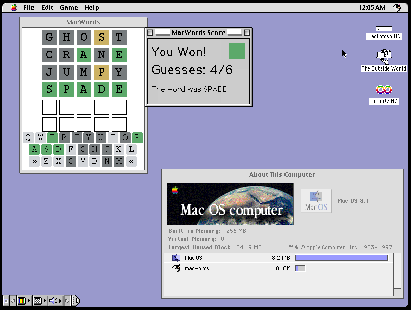

# MacWords

MacWords is an implementation of a word guessing game for classic mac
computers (System 7.5 - Mac OS 9)



# Compiling MacWords

MacWords was built using MPW. In order to compile MacWords, all
`.cc` and `.hh` files must be converted to (classic) Mac OS Line Endings.
On Unix, the `tr` command is suitable for this purpose.

Assuming the sponge command is installed:

```
cat engine.cc | tr '\n' '\r' | sponge engine.cc
```

Otherwise:

```
cat engine.cc | tr '\n' '\r' > engine_mac.cc
```

Repeat this for all .cc and .hh files.

Place all Mac-formatted .cc and .hh files along with the macwords.r DeRez
resource file onto the classic Mac in a folder called `macwords`.
Then, use MPW to set the directory to the newly-created `macwords` folder.
Create new build commands named macwords including all .cc and .r files as
source. 
Include the macwords folder as a search path (this should be :, the root). 
Choose to build a Mac OS application for PPC Classic or 32 bit 68k or both.

Once the Makefile is created, perform a build using command-B and typing
macwords.
